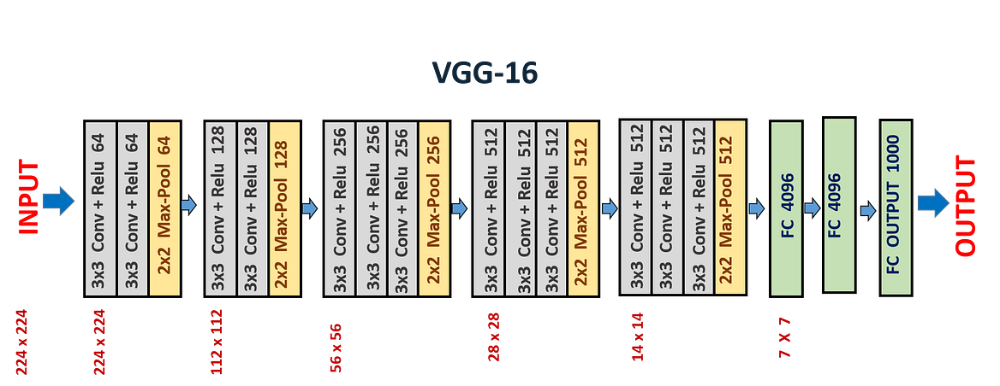

# VGG-16 architecture from scratch

## About architecture
- It is a typical deep Convolutional Neural Network (CNN) design with numerous layers, and the abbreviation VGG stands for Visual Geometry Group. The term “deep” describes the number of layers, with VGG-16 or VGG-19 having 16 or 19 convolutional layers, respectively.
- In this repository, I desined VGG-16 from scratch.  
- Innovative object identification models are built using the VGG architecture. The VGGNet, created as a deep neural network, outperforms benchmarks on a variety of tasks and datasets outside of ImageNet. It also remains one of the most often used image recognition architectures today.

### Convolutional Layers
- VGG’s convolutional layers use the smallest feasible receptive field, or 33, to record left-to-right and up-to-down movement. Additionally, 11 convolution filters are used to transform the input linearly. The next component is a ReLU unit, a significant advancement from AlexNet that shortens training time. Rectified linear unit activation function, or ReLU, is a piecewise linear function that, if the input is positive, outputs the input; otherwise, the output is zero. The convolution stride is fixed at 1 pixel to keep the spatial resolution preserved after convolution (stride is the number of pixel shifts over the input matrix).

### Hidden Layers 
- The VGG network’s hidden layers all make use of ReLU. Local Response Normalization (LRN) is typically not used with VGG as it increases memory usage and training time. Furthermore, it doesn’t increase overall accuracy.

### Fully Connected Layers
- The VGGNet contains three layers with full connectivity. The first two levels each have 4096 channels, while the third layer has 1000 channels with one channel for each class.